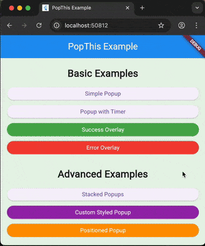

# pop_this

A powerful and customizable Flutter package for managing popups, toasts, and overlays. `pop_this` provides an easy-to-use API for displaying widgets on top of your application with support for animations, stacking (navigation history within popups), auto-dismissal timers, and preset success/error overlays.



## Features

- **Easy Popup Management**: Show any widget as a popup with a single function call.
- **Stacked Popups**: Open multiple popups on top of each other. The package automatically handles navigation history, allowing users to go back to previous popups.
- **Auto-Dismissal**: Built-in timer support to automatically dismiss popups after a specified duration.
- **Customizable Animations**: Control entry and exit animations, durations, and curves.
- **Styling**: Extensive customization options for background overlays, shadows, border radius, and colors.
- **Preset Overlays**: Quickly show success or error messages with pre-styled overlays.
- **Blur Support**: Optional background blur effect.

## Installation

Add this to your package's `pubspec.yaml` file:

```yaml
dependencies:
  pop_this: ^1.0.0
```

## Usage

### Basic Usage

Import the package:

```dart
import 'package:pop_this/pop_this.dart';
```

Show a simple popup:

```dart
PopThis.pop(
  context: context,
  child: Container(
    padding: EdgeInsets.all(20),
    color: Colors.white,
    child: Text("Hello from PopThis!"),
  ),
);
```

### Auto-Dismiss with Timer

```dart
PopThis.pop(
  context: context,
  duration: Duration(seconds: 3),
  showTimer: true, // Shows a circular countdown timer
  child: Text("I will disappear in 3 seconds"),
);
```

### Success and Error Overlays

```dart
// Show a success message
PopThis.showSuccessOverlay(
  successMessage: "Data saved successfully!",
  duration: Duration(seconds: 2),
);

// Show an error message
PopThis.showErrorOverlay(
  errorMessage: "Failed to connect to server.",
  duration: Duration(seconds: 2),
);
```

### Advanced Customization

```dart
PopThis.pop(
  context: context,
  blurBackground: true, // Blur the background
  dismissBarrierColor: Colors.black.withOpacity(0.5),
  popUpAnimationDuration: 0.5, // Animation duration in seconds
  child: YourCustomWidget(),
);
```

## License

This project is licensed under the MIT License - see the [LICENSE](LICENSE) file for details.


## Repository

https://github.com/SoundSliced/pop_this
